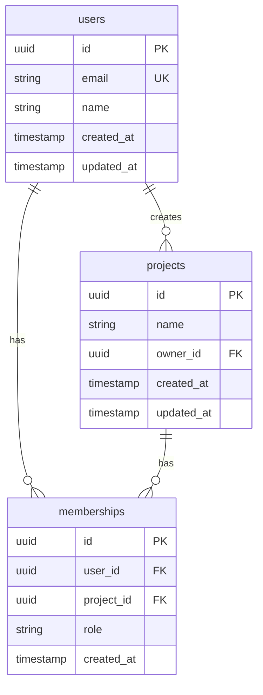

# データベース設計

{{PROJECT_NAME}} のデータベース設計を説明します。

<!-- 
📝 書くべき内容:
- ER図（またはリンク）
- テーブル定義
- RLS（Row Level Security）ポリシー
- インデックス設計
- マイグレーション方針

カスタマイズ:
- プロジェクトのDB設計に合わせて更新
- 使用しないセクションは削除
-->

## 📚 目次

1. [概要](#概要)
2. [ER図](#er図)
3. [テーブル定義](#テーブル定義)
4. [RLSポリシー](#rlsポリシー)
5. [マイグレーション](#マイグレーション)

---

## 概要

### 使用データベース

- **種類**: {{DB_TYPE}}
- **バージョン**: <!-- バージョン -->

### 設計方針

1. **正規化**: 第3正規形を基本とする
2. **命名規則**: snake_case、複数形（`users`, `projects`）
3. **主キー**: UUID または自動採番ID
4. **監査列**: `created_at`, `updated_at` を全テーブルに設定

---

## ER図

<!-- 
ER図を記載またはリンク
ツール例: dbdiagram.io, Mermaid, PlantUML
-->



---

## テーブル定義

### users

ユーザー情報を管理するテーブル。

| カラム名 | 型 | 制約 | 説明 |
|---------|-----|------|------|
| `id` | UUID | PK | 主キー |
| `email` | VARCHAR(255) | UK, NOT NULL | メールアドレス |
| `name` | VARCHAR(100) | NOT NULL | 表示名 |
| `avatar_url` | TEXT | | アバター画像URL |
| `created_at` | TIMESTAMP | NOT NULL, DEFAULT NOW() | 作成日時 |
| `updated_at` | TIMESTAMP | NOT NULL, DEFAULT NOW() | 更新日時 |

**インデックス**:
- `users_email_idx` (email)

**SQL**:
```sql
CREATE TABLE users (
    id UUID PRIMARY KEY DEFAULT gen_random_uuid(),
    email VARCHAR(255) NOT NULL UNIQUE,
    name VARCHAR(100) NOT NULL,
    avatar_url TEXT,
    created_at TIMESTAMP WITH TIME ZONE NOT NULL DEFAULT NOW(),
    updated_at TIMESTAMP WITH TIME ZONE NOT NULL DEFAULT NOW()
);

CREATE INDEX users_email_idx ON users(email);
```

---

### projects

プロジェクト情報を管理するテーブル。

| カラム名 | 型 | 制約 | 説明 |
|---------|-----|------|------|
| `id` | UUID | PK | 主キー |
| `name` | VARCHAR(200) | NOT NULL | プロジェクト名 |
| `description` | TEXT | | 説明 |
| `owner_id` | UUID | FK, NOT NULL | 所有者ID |
| `created_at` | TIMESTAMP | NOT NULL, DEFAULT NOW() | 作成日時 |
| `updated_at` | TIMESTAMP | NOT NULL, DEFAULT NOW() | 更新日時 |

**外部キー**:
- `owner_id` → `users(id)` ON DELETE CASCADE

**SQL**:
```sql
CREATE TABLE projects (
    id UUID PRIMARY KEY DEFAULT gen_random_uuid(),
    name VARCHAR(200) NOT NULL,
    description TEXT,
    owner_id UUID NOT NULL REFERENCES users(id) ON DELETE CASCADE,
    created_at TIMESTAMP WITH TIME ZONE NOT NULL DEFAULT NOW(),
    updated_at TIMESTAMP WITH TIME ZONE NOT NULL DEFAULT NOW()
);
```

---

### memberships

ユーザーとプロジェクトの関連を管理するテーブル。

| カラム名 | 型 | 制約 | 説明 |
|---------|-----|------|------|
| `id` | UUID | PK | 主キー |
| `user_id` | UUID | FK, NOT NULL | ユーザーID |
| `project_id` | UUID | FK, NOT NULL | プロジェクトID |
| `role` | VARCHAR(50) | NOT NULL | ロール（admin, member, viewer） |
| `created_at` | TIMESTAMP | NOT NULL, DEFAULT NOW() | 作成日時 |

**複合ユニーク制約**:
- `(user_id, project_id)`

**SQL**:
```sql
CREATE TABLE memberships (
    id UUID PRIMARY KEY DEFAULT gen_random_uuid(),
    user_id UUID NOT NULL REFERENCES users(id) ON DELETE CASCADE,
    project_id UUID NOT NULL REFERENCES projects(id) ON DELETE CASCADE,
    role VARCHAR(50) NOT NULL DEFAULT 'member',
    created_at TIMESTAMP WITH TIME ZONE NOT NULL DEFAULT NOW(),
    UNIQUE(user_id, project_id)
);
```

---

## RLSポリシー

<!-- Supabase等でRLSを使用する場合 -->

### 基本方針

- すべてのテーブルでRLSを有効化
- 認証ユーザーのみがデータにアクセス可能
- ユーザーは自身のデータと所属プロジェクトのデータのみ参照可能

### usersテーブルのポリシー

```sql
-- RLSを有効化
ALTER TABLE users ENABLE ROW LEVEL SECURITY;

-- 自分のデータのみ参照可能
CREATE POLICY "Users can view own data" ON users
    FOR SELECT
    USING (auth.uid() = id);

-- 自分のデータのみ更新可能
CREATE POLICY "Users can update own data" ON users
    FOR UPDATE
    USING (auth.uid() = id);
```

### projectsテーブルのポリシー

```sql
ALTER TABLE projects ENABLE ROW LEVEL SECURITY;

-- メンバーのみ参照可能
CREATE POLICY "Project members can view" ON projects
    FOR SELECT
    USING (
        EXISTS (
            SELECT 1 FROM memberships
            WHERE memberships.project_id = projects.id
            AND memberships.user_id = auth.uid()
        )
    );

-- オーナーのみ更新可能
CREATE POLICY "Project owners can update" ON projects
    FOR UPDATE
    USING (owner_id = auth.uid());
```

---

## マイグレーション

### 方針

- マイグレーションファイルは `supabase/migrations/` に配置
- ファイル名: `YYYYMMDDHHMMSS_description.sql`
- ロールバック用のDOWNスクリプトも作成

### コマンド

```bash
# マイグレーション作成
npx supabase migration new add_users_table

# マイグレーション実行
npx supabase db push

# マイグレーション状態確認
npx supabase migration list
```

---

## 関連ドキュメント

- [overview.md](./overview.md) - プロジェクト概要
- [requirements.md](./requirements.md) - 要件定義
- [../guides/95-security.md](../guides/95-security.md) - セキュリティ（RLS詳細）

---

**最終更新**: YYYY-MM-DD

