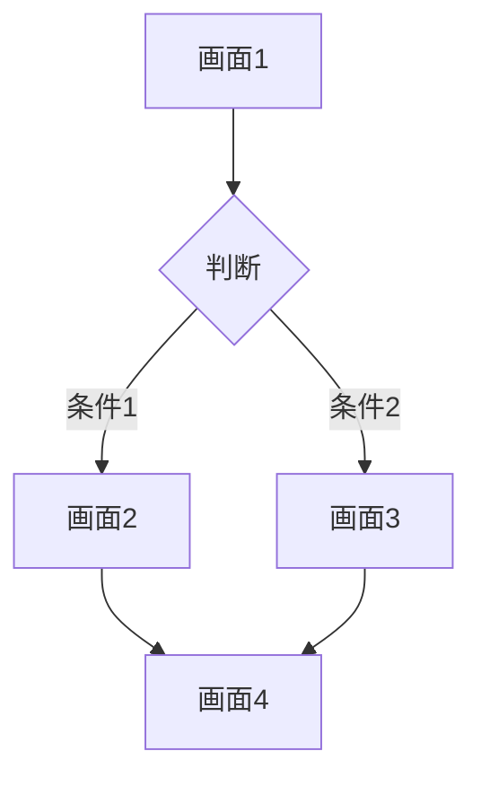

# ユーザーフロー: <!-- フロー名 -->

<!-- 
📝 このテンプレートの使い方:
1. このファイルを複製
2. ファイル名をフローに合わせて変更（例: login-to-dashboard.md）
3. 各セクションを埋める

書くべき内容:
- フローの概要と目的
- アクター（誰が）
- 前提条件と事後条件
- ステップバイステップのフロー
- 画面遷移図
- エラーケース
-->

## 概要

<!-- フローの概要を1-2文で説明 -->

**目的**: <!-- このフローで達成したいこと -->

**アクター**: <!-- 誰がこのフローを実行するか -->

---

## 前提条件

<!-- このフローを開始するための条件 -->

- [ ] <!-- 条件1 -->
- [ ] <!-- 条件2 -->

## 事後条件

<!-- フロー完了後の状態 -->

- [ ] <!-- 状態1 -->
- [ ] <!-- 状態2 -->

---

## 基本フロー

### ステップ1: <!-- ステップ名 -->

| 項目 | 内容 |
|------|------|
| **画面** | <!-- 画面名 --> |
| **ユーザーアクション** | <!-- ユーザーが行うこと --> |
| **システム応答** | <!-- システムの反応 --> |

### ステップ2: <!-- ステップ名 -->

| 項目 | 内容 |
|------|------|
| **画面** | <!-- 画面名 --> |
| **ユーザーアクション** | <!-- ユーザーが行うこと --> |
| **システム応答** | <!-- システムの反応 --> |

### ステップ3: <!-- ステップ名 -->

| 項目 | 内容 |
|------|------|
| **画面** | <!-- 画面名 --> |
| **ユーザーアクション** | <!-- ユーザーが行うこと --> |
| **システム応答** | <!-- システムの反応 --> |

<!-- 必要に応じてステップを追加 -->

---

## 画面遷移図

<!-- 
または簡易版:

画面1 → 画面2 → 画面3 → 画面4
         ↓
        画面5（エラー時）
-->

---

## 代替フロー

### 代替フロー1: <!-- 代替フロー名 -->

**発生条件**: <!-- いつこのフローに分岐するか -->

1. <!-- ステップ1 -->
2. <!-- ステップ2 -->

---

## エラーケース

### エラー1: <!-- エラー名 -->

| 項目 | 内容 |
|------|------|
| **発生条件** | <!-- いつ発生するか --> |
| **エラーメッセージ** | <!-- ユーザーに表示するメッセージ --> |
| **復帰方法** | <!-- どうやって正常フローに戻るか --> |

### エラー2: <!-- エラー名 -->

| 項目 | 内容 |
|------|------|
| **発生条件** | <!-- いつ発生するか --> |
| **エラーメッセージ** | <!-- ユーザーに表示するメッセージ --> |
| **復帰方法** | <!-- どうやって正常フローに戻るか --> |

---

## UI実装メモ

<!-- 実装時の参考情報 -->

### 関連コンポーネント

- `ComponentName1` - <!-- 役割 -->
- `ComponentName2` - <!-- 役割 -->

### 状態管理

- <!-- どの状態をどこで管理するか -->

---

## 関連ドキュメント

- [../overview.md](../overview.md) - プロジェクト概要
- [../features/](../features/) - 機能仕様
- [../../guides/60-ui-components.md](../../guides/60-ui-components.md) - UIコンポーネント

---

## 更新履歴

| 日付 | 更新者 | 内容 |
|------|--------|------|
| YYYY-MM-DD | <!-- 名前 --> | 初版作成 |

